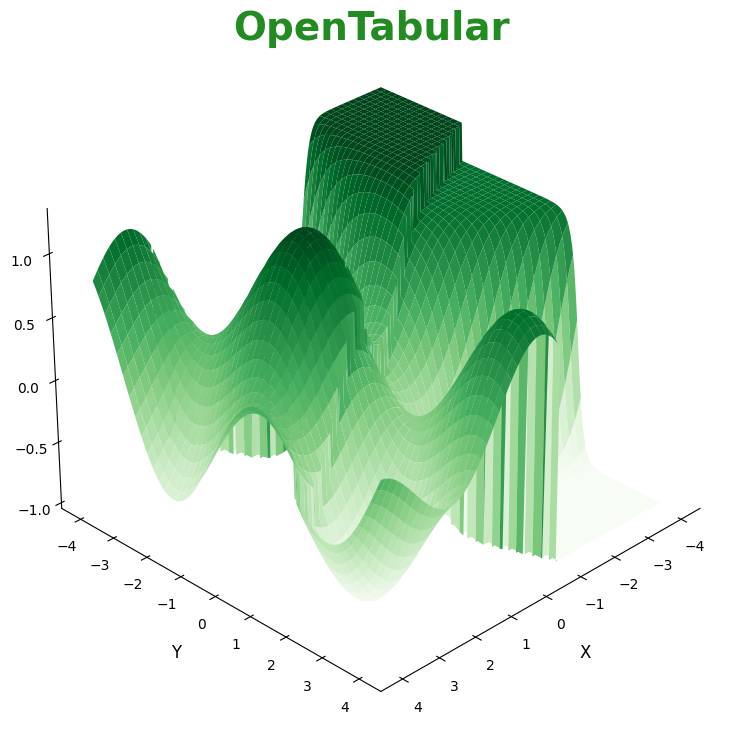

  

  <h1>Welcome to OpenTabular</h1>

---

**OpenTabular** is an open research and development organization focused on **Tabular Data** — combining the strengths of **Tabular Deep Learning**, **Tabular Machine Learning**, and **Statistical Modeling**.

We aim to build high-quality, accessible tools and libraries for working with structured data — from interpretable classical models to state-of-the-art neural methods.

### 📦 What to Expect

We host a growing collection of repositories, including:

- 🧠 Deep learning models tailored for tabular data
- 🤖 Machine learning pipelines and baselines for structured datasets
- 📈 Statistical and probabilistic tools grounded in tabular modeling
- 🧪 Experimental hybrids bridging DL, ML, and statistics
- 🛠️ Utilities for preprocessing, evaluation, visualization, and benchmarking

### 🤝 Get Involved

If you're working with tabular data — whether as a researcher, engineer, or enthusiast — you're in the right place.  
Follow the organization and explore our repositories as we grow the open ecosystem for tabular understanding.
